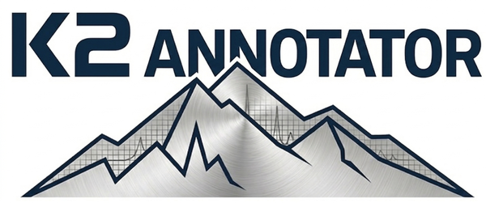

# K2 Annotator

<p align="center">
  
</p>

**Open-source GC-MS data processing and Level 2 compound identification.** (v3.1.0)

## Overview

K2 Annotator is an open-source pipeline for non-targeted GC-MS suspect screening, providing automated processing from raw instrument files to Level 2 compound identification. The pipeline integrates:

- **Raw file conversion** via ProteoWizard MSConvert
- **Feature detection and deconvolution** via MZmine
- **Spectral library matching** with Retention Index, Kwiecien-style RHRMF (10 ppm about the cation m/z, isotopologue substitution, TIC-weighted scoring), and a 10 ppm peak-paired dot product for exact-mass library entries. The exact computations are documented in [docs/SCORING_METHODS.md](docs/SCORING_METHODS.md).
- **Hazard screening** via EPA CompTox APIs
- **Surrogate standard recovery** calculation (v3.0.0+)

## Features

- **One-touch processing**: GUI-based workflow from raw data to annotated results
- **Level 2 identification**: Spectral matching with RI validation following Koelmel et al. 2022 criteria
- **Blank Feature Filtering**: Automatic removal of background contamination
- **Internal Standard normalization**: Multiple methods for inter-sample variability correction
- **Surrogate recovery**: Track labeled surrogate standards through sample processing
- **Hazard assessment**: Integrated EPA CompTox database lookups with GHS classification

## Quick Start

### Prerequisites

- Python 3.8 or higher
- Windows 10/11 (for GUI features)

### Installation

1. Clone this repository:
   ```bash
   git clone https://github.com/brunetch123/K2-GCMS-Pipeline.git
   cd K2-GCMS-Pipeline
   ```
2. Install Python dependencies:
   ```bash
   pip install -r requirements.txt
   ```
3. Install external tools (required for full pipeline):
   - [ProteoWizard MSConvert](https://proteowizard.sourceforge.io/) — for raw file conversion (vendor raw → mzML)
   - [MZmine](https://mzmine.github.io/) (3.x or 4.x) — for feature detection and deconvolution
4. Provide a spectral library in CSV or MSP format (see **Library Formats** below)

### Running the GUI

```bash
python scripts/k2_gui.py
```

Or use the provided batch file:
```bash
K2.bat
```

### Command Line Usage

```bash
python scripts/cli.py --quant data.csv --msp spectra.msp --library library.msp \
                      --ri-cal alkanes.txt --grouping sample_grouping.json --output results/
```

`--ri-cal` is required for MZmine data (RI is a mandatory Level-2 criterion).
`--grouping` takes the per-sample Blank/Sample/Reference table the GUI writes;
without it, blanks are recognised by the `--blank-id` substring. Every run
writes `run_manifest.json` (versions, input hashes, resolved options). Exit
code 0 = matches found, 2 = completed with no matches, 1 = error.

### Running the tests

```bash
python -m pytest
```

The `tests/` package (99 tests) builds a synthetic dataset from fragment
formulas and checks every Level-2 criterion, the input parsers and the
end-to-end CLI. Run it after changing anything under `scripts/src/`.

## External Dependencies

K2 Annotator requires the following tools to be installed separately (they are not bundled due to size and licensing):

| Tool | Purpose | Download |
|------|---------|----------|
| **ProteoWizard MSConvert** | Convert raw instrument data to mzML (any vendor format MSConvert supports) | [proteowizard.sourceforge.io](https://proteowizard.sourceforge.io/) |
| **MZmine** (3.x or 4.x) | Feature detection, deconvolution, quantification | [mzmine.github.io](https://mzmine.github.io/) |

Place these in a `software/` directory alongside this repository, or configure their paths in the K2 Annotator GUI settings.

## Supported Input Formats

K2 Annotator can ingest data at three points in the workflow:

| Entry point | Accepts |
|-------------|---------|
| **Raw instrument data** | Any vendor format MSConvert can read (e.g. Agilent `.D`, Bruker `.d`, Thermo `.raw`, Sciex `.wiff`, Waters `.raw`, Shimadzu `.lcd`). The pipeline converts to mzML, runs MZmine, and matches against the library. |
| **mzML files** | Pre-converted mzML. Skips MSConvert; runs MZmine and matching. |
| **MZmine output** | Pre-deconvoluted feature list (CSV) and spectra (MSP). Matching only. MS-DIAL output in the same form is also accepted. |

> ⚠️ **Tested with Agilent .D folders.** Other vendor formats are passed through to MSConvert's native readers and are accepted on a best-effort basis. If you run K2 Annotator on a non-Agilent format and hit a problem, please file an issue with the vendor and file extension.

## Spectral Library

K2 Annotator requires a spectral library for compound identification. Users must provide their own library file in one of the supported formats below. Example templates are included in the `templates/` directory.

### CSV Format
```csv
name,formula,ri,cas,inchikey,peaks_json
Naphthalene,C10H8,1181,91-20-3,UFWIBTONFRDIAS-UHFFFAOYSA-N,"[[128,999],[127,150]]"
```

### MSP Format (NIST-compatible)
```
NAME: Naphthalene
FORMULA: C10H8
RI: 1181
CAS: 91-20-3
INCHIKEY: UFWIBTONFRDIAS-UHFFFAOYSA-N
Num Peaks: 2
128 999
127 150
```

## Documentation

- **[K2_USER_GUIDE.md](K2_USER_GUIDE.md)** — Complete user documentation
- **[QUICK_START.md](QUICK_START.md)** — Quick start guide
- **[INSTALLATION.txt](INSTALLATION.txt)** — Detailed installation instructions
- **[CHANGELOG.md](CHANGELOG.md)** — Version history and changes

## Project Structure

```
K2-GCMS-Pipeline/
├── scripts/
│   ├── k2_gui.py          # Main GUI application
│   ├── cli.py             # Command-line interface
│   ├── gcms_pipeline.py   # Pipeline orchestration
│   ├── k2_config.py       # Configuration management
│   ├── k2_screens.py      # GUI screen definitions
│   └── src/               # Core processing modules
│       ├── version.py             # Version string (single source of truth)
│       ├── msp_reader.py          # Tolerant MSP reader shared by all parsers
│       ├── universal_parser.py    # MZmine / MS-DIAL feature-table parser, BFF
│       ├── library_parser.py      # Library file parser (CSV / MSP)
│       ├── matching_engine.py     # Level-2 matching
│       ├── spectral_math.py       # Dot products (unit-mass and 10 ppm paired)
│       ├── rhrmf.py               # Reverse HR mass filter, HR detector
│       ├── ri_calibration.py      # Retention index calibration
│       ├── is_normalizer.py       # Internal standard normalization
│       ├── reporter.py            # Report generation
│       ├── summary_tables.py      # Feature/match summary CSV+PDF
│       ├── run_manifest.py        # run_manifest.json provenance record
│       ├── surrogate_analyzer.py  # Surrogate recovery analysis
│       ├── surrogate_reporter.py  # Surrogate recovery reports
│       ├── structure_helper.py    # PubChem structures / GHS hazard data
│       ├── ctx_client.py          # EPA CompTox (ctxpy) client
│       └── http_session.py        # Shared HTTP session (timeouts, retries, rate limit)
├── tests/                 # pytest suite + synthetic dataset generator
├── docs/                  # SCORING_METHODS.md, diagrams, plans
├── config/                # MZmine workflow configurations
├── templates/             # Library format templates, test data, alkane table
├── users/                 # MZmine user profiles
├── K2.bat                 # Windows launch script
├── K2.spec                # PyInstaller build specification
├── requirements.txt       # Python dependencies
└── LICENSE                # MIT License
```

## Building the Executable (Optional)

To build a standalone Windows executable:

```bash
pip install pyinstaller
pyinstaller K2.spec
```

The executable will be created in `dist/K2/`.

## Python Dependencies

See [requirements.txt](requirements.txt):
- **pandas**, **numpy** — Data processing
- **matplotlib**, **Pillow** — Visualization
- **reportlab** — PDF generation
- **ctx-python** — EPA CompTox API
- **scipy** — RI calibration spline
- **molmass** — Molecular weight calculations
- **requests** — HTTP client

## Citation

If you use K2 Annotator in your research, please cite:

*Brunet, C. (2026). K2 Annotator: an open-source GC-MS suspect screening pipeline. DOI: 10.5281/zenodo.20149465

## License

This project is licensed under the MIT License.

## Support

For bug reports, feature requests, or questions email: brunet.chris@gmail.com. I am not a professional software developer and make no garuntees about what I will be able to help with but will try my best to resolve issues
or address your needs from the software. 


---

**© 2026 K2 Annotator**
